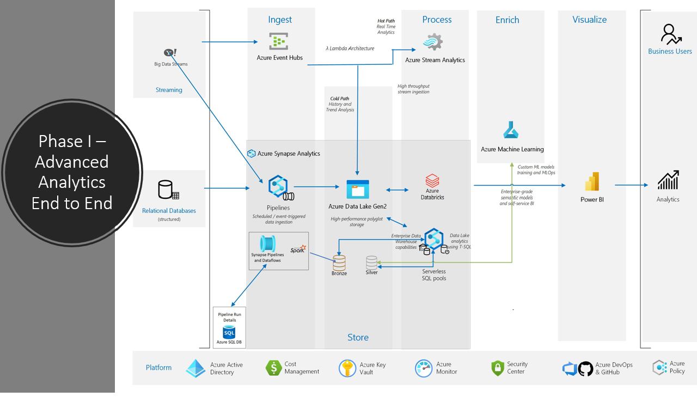

# World Wide Importers

Wide World Importers (WWI) is a wholesale novelty goods importer and distributor operating from the San Francisco bay area.

As a wholesaler, WWI's customers are mostly companies who resell to individuals. WWI sells to retail customers across the United States, including specialty stores, supermarkets, computing stores, tourist attraction shops, and some individuals. WWI sells to other wholesalers via a network of agents who promote the products on WWI's behalf. While all of WWI's customers are currently based in the United States, the company intends to expand into other countries.

WWI buys goods from suppliers, including novelty and toy manufacturers, and other novelty wholesalers. They stock the goods in their WWI warehouse and reorder from suppliers as needed to fulfill customer orders. They also purchase large volumes of packaging materials and sell these in smaller quantities as a convenience for the customers.

Recently WWI started to sell a variety of edible novelties such as chili chocolates. The company previously did not have to handle chilled items. To meet food handling requirements, they must monitor the temperature in their chiller room and any of their trucks that have chiller sections.

**Walkthrough Flows** 

<!-- TOC -->
- [About World Wide Importers](#world-wide-importers)
- [Modern Data Warehousing and Machine Learning with Azure Synapse Analytics and Azure Machie Learning step-by-step](#modern-data-warehousing-and-machine-learning-with-azure-synapse-analytics-and-azure-machie-learning-step-by-step)
  - [Scenario](#scenario)
  - [Abstract and learning objectives](#abstract-and-learning-objectives)
  - [Overview](#overview)
  - [Solution architecture](#solution-architecture)
  - [Requirements](#requirements)
  - [Before the hands-on lab](#before-the-hands-on-lab)
  - [Resource naming throughout this lab](#resource-naming-throughout-this-lab)
  - [Exercise 1: Prepare the workload environment](#exercise-1-prepare-the-workload-environment---create-resources-for-the-solution)
    - [Task 1: Create Azure Synapse Workspace](#task-1-create-azure-synapse-workspace)
    - [Task 2: Create Azure Databricks Workspace](#task-2-create-azure-databricks-workspace)
    - [Task 3: Create Azure Machine Learning Workspace](#task-3-create-azure-machine-learning-workspace)
  - [Excercise 2: Implement End to End Batch Analytics Solution](#exercise-2-implement-end-to-end-batch-analytics-solution)
  - [Exercise 3: Implement End to End Real Time Analytics Pipeline](#exercise-3-implement-end-to-end-real-analytics-solution)
  - [Exercise 4: Train, score and consume Machine Learning Model](#exercise-4-train-score-and-consume-machine-learning-model)
 
<!-- /TOC -->

# Modern Data Warehousing and Machine Learning with Azure Synapse Analytics and Azure Machie Learning step-by-step

## Scenario
Currently, WWI has SQL Server based on premises data warehouse solution. They are working on modernizing the solution in the cloud. They reached out to FastTrack for Azure team to help implement a modern data housing solution/POC in Azure, leveraging Azure Synapse, Azure ML for Machine Learning, Azure Databricks and Power BI.

WWI would like to leverage one platform to achieve both their real time and batch analytics goals as part of there innovation and modernization efforts. They believe Azure Synapse Analytics can help them achieve that goal, implementing the solution through Lambda Architecture, a modern big data analytics patterns.

With Azure Synapse platform Serverless SQL Pools, WWI can migrate their existing DW solution with few changes as well as get more frequent updates to their data for reporting  and analytics without the overhead of loading to Dedicated Pools. This will save costs while they further evaluate if, how and when the solution should be moved to a dedicated SQL Pool. Data processing for ML use cases, since they have a lots of realtime data, they wanted a scalable solution, where they can respond to the data growth needs without worrying about cost, whey they do not have any processing needed.

## Abstract and learning objectives

In this mission is to show case how we can build an end-to-end data advanced analytics solution using Azure Synapse Analytics, Azure Databricks and Azure Machine Learning services. The information will be presented in the context of a retail scenario, as described above. We will be heavily leveraging Azure Synapse Studio, Azure Databricks and Azure Machine Learning Studio as our development tools as we walk through common data operations from ingestion, transformation, querying, model training and visualization. While we can leverage Azure Synapse for all data engineering and data science activites, we wanted to build a scenario where multiple Azure Services could be leveraged to implement the solution, as we see our customers ask for alternate options when building advanced analytics solutions in Azure.

## Overview

In our implementation, we will explore various features of Azure Synapse Analytics, Azure Databricks and Azure Machine Learning Services. Azure Synapse Analytics Studio is a single tool that every team member can use collaboratively, for data engineering needs. We will however leverage Azure Databricks alnog with Synapse Studio, as we ingest, clean, and transform raw data.  We will then leverage Azure Machine Learning Studio to train, register, and consume a Machine learning model. We would like to have hands-on-experience building this solution.

## Solution architecture

Our solution leverages the lambda architecture pattern, to handle the ingestion, processing, and analysis of data. We will explore:

* Batch processing of big data sources at rest.
* Real-time processing of big data in motion.

We will have the detailed implementation steps in the relevant section below for pattern for World Wide Importers.

The data files we generate during the ingestion and processing will be CSV, and parquet. This data will be ingested into Synapse Analytics via Pipelines. From there, the data can be transformed and enriched using various tools such as data flows, Synapse Spark, Azure Datbricks, and Synapse SQL (both provisioned and serverless). Once processed, data can be queried using Synapse SQL tooling. Azure Synapse Studio also provides the ability to author notebooks to further process data, create datasets, train, and create machine learning models. These models can then be stored in a storage account or even in a SQL table. These models can then be consumed via various methods, including T-SQL. The foundational component supporting all aspects of Azure Synapse Analytics is the ADLS Gen 2 Data Lake.

## Requirements

1. Microsoft Azure subscription

2. Azure Synapse Workspace / Studio

3. Azure Databricks

4. Azure Machine Learning Workspace / Studio

5. [Python v.3.7 or newer](https://www.python.org/downloads/)

6. [PIP](https://pip.pypa.io/en/stable/installing/#do-i-need-to-install-pip)

7. [Visual Studio Code](https://code.visualstudio.com/)

8. [Python Extension for Visual Studio Code](https://marketplace.visualstudio.com/items?itemName=ms-python.python)

9. Azure Function Core Tools v.3](https://docs.microsoft.com/en-us/azure/azure-functions/functions-run-local?tabs=windows%2Ccsharp%2Cbash#v2)

10. [Azure Functions Extension for Visual Studio Code](https://marketplace.visualstudio.com/items?itemName=ms-azuretools.vscode-azurefunctions)

11. [Postman](https://www.postman.com/downloads/)

12. [Ensure the Microsoft.Sql resource provider is registered in your Azure Subscription](https://docs.microsoft.com/en-us/azure/azure-resource-manager/management/resource-providers-and-types).

13. Azure Stream Analytics

## Before the Journey

Refer to the Before the hands-on lab setup guide manual before continuing to the lab exercises.

## Resource naming throughout this lab

For the hands-on walk throughs, we recommend that you adopt a naming convention, following the guidelines in the article [Define your naming convention](https://docs.microsoft.com/en-us/azure/cloud-adoption-framework/ready/azure-best-practices/resource-naming). 

## Exercise 1: Prepare the workload environment - create resources for the solution

In our walkthroughs, we will need several resources to implement end to end real-time and batch analytics pipelines. For btch analytics, for example, we will leverage Azure Synapse Analytics Studio. For Data Engineering works, for real-time works, we will leverage Azure Databricks Activity. For machine learning activities, we will resort to Azure ML Studio. In this exercise, we will provision the necessary resources for our solution. We will first introduce the major services involved and then bring the other services we need in the picture.

### Task 1: Create Azure Synapse Workspace

Following [Quickstart: Create a Synapse workspace](https://docs.microsoft.com/en-us/azure/synapse-analytics/quickstart-create-workspace), create your Azure Synapse Workspace. Please note that we are creating other resources like Azure Data Lake Store Gen2 for storage needs

### Task 2: Create Azure Databricks Workspace

Use the Azure portal to create an Azure Databricks workspace with an Apache Spark cluster. For detailed steps, follow the article [Quickstart: Run a Spark job on Azure Databricks Workspace using the Azure portal](https://docs.microsoft.com/en-us/azure/databricks/scenarios/quickstart-create-databricks-workspace-portal?tabs=azure-portal)

### Task 3: Create Azure Machine Learning Workspace

For our machine learning needs, we will leverage Azure Machine Learning, as we see customers love the machine learning studio for model training and inferencing. Use [Quickstart: Create workspace resources you need to get started with Azure Machine Learning](https://docs.microsoft.com/en-us/azure/machine-learning/quickstart-create-resources)

## Exercise 2: Implement End to End Batch Analytics Solution

For Batch Analytics we will work with relational data.
* We first restored WWImporter database to Azure SQL DB and ran stored procedures to get data through the current date
* We designed a meta-data driven Pipeline approach for loading data from Azure SQL DB to ADLS; this required a small Azure SQL DB to store the data loading logic in a table
* Azure Synapse Pipelines read data from the data load definition database and performs either Copy Data Activities for full-load tables or Dataflow Activities for incremental updates to load the data from the WWImporter Database to Parquet files in ADLS (Bronze Layer)
* A Spark Notebook contains python code to extract the current WWI Stock price throughout the day – this data is used to see if there is any correlation between sales and the stock price as well as get near real time updates of the WWI stock price; The latest stock price for each day is also stored in ADLS
* Serverless SQL Database contains views over the ADLS files to denormalize the data into a Star Schema
* Power BI is leveraged to create a dataset from the SQL Serverless database views along with the reports needed by the end users; The end users will be able to see near-real time orders throughout the day*

## Exercise 3: Implement End to End Real Analytics Solution
For real-time analytics scenario, we will leverage yahoo API to generate the real-time data for a date range and stream the data as events.
* To demonstrate real-time analytics capabilities under the same Azure Synapse platform, we are leveraging a data ingestion pipeline through Azure Event Hub. A small program creates an event for rows of data, from yahoo finances snapped for a date range. Once the event shows up, Azure Stream Analytics processes the data and puts the data into Azure Data Lake Store (ADLS Gen2).
* As part of Data Engineering, Azure Databricks mounts the store in Databricks and processes data so we have a prepared dataset that we can build model on. This process is kicked off through Azure Synapse Pipeline (Mount Pipeline + Data Processing Pipeline)

## Exercise 4: Train, Score and Consume Machine Learning Model
* Azure ML picks up the data from ADLS store, trains a model and deploys the model to Azure Container Instance, as a real time endpoint, to predict on the stock price closing trends

